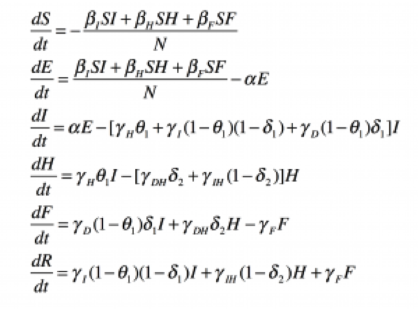

Background and References
=========================

Ebola Epidemic Modeling
-----------------------
A compartmental model [1-2] has been proposed and used to study the Ebola 
outbreaks in the Democratic Republic of Congo (1995), in Uganda (2000), 
and in Sierra Leone and Liberia (2014). In this compartmental model, 
individuals are classified as: (1) susceptible individuals, S, who can 
be infected by the Ebola virus following contact with infectious cases; 
(2) exposed individuals, E, who have been infected by the Ebola virus but 
are not yet infectious or symptomatic; (3) symptomatic and infectious 
individuals in the community, I; (4) hospitalized Ebola cases, H, who are 
infectious; (5) dead Ebola cases, F, who may transmit the disease during 
funeral procedures; and (6) individuals removed from the chain of transmission, 
R, due to recovering from the disease or being buried. The dynamics for the 
population of these types of individuals are modeled through the coupled 
ordinary differential equations (ODEs) given in the following system:

These governing ODEs consider the populations of each compartment to be 
continuous. Solving this type of system is deterministic. A given solution 
can be found for given inputs. However, we know that the populations are not 
continuous. Instead, they are always discrete, and they are always integers. 
Thus, while a deterministic formulation of the problem may result in a solution 
that represents the most probable outcome, we know that many outcomes are 
actually possible. Thus, for this type of problem a stochastic formulation of 
the equations can be more appropriate. With this approach, the interpretation 
of the coefficients in the equations is changed. In the deterministic
formulation, these coefficients are thought of as reaction "rates". However,
in the stochastic formulation they are interpreted as reaction "probabilities
per unit time". Using a stochastic formulation, we can solve for not only the
most probable outcome of the outbreak, but we can also solve for standard 
deviations and confidence intervals to understand the worst- and best- case 
scenarios. In order to solve the stochastic formulation of the basic 
equations, we utilize Gillespie's first reaction method [3]. In order to 
solve for a single trajectory for the future compartmental values, the 
Gillespie algorithm can be briefly summarized as follows:

* Initialize the compartment populations and reaction constants.
* For each possible reaction (infection, death, hospitalization, etc...), 
  calculate the probability that it will be the next reaction.
* Generate random numbers to determine the next reaction using the 
  probabilities and the time interval to next reaction.
* Update and repeat until the final time.

For more details, see [3]. Using these steps, a single trajectory is solved 
for. By generating many trajectories, mean trajectories and standard deviations 
can be generated with increasing accuracy as the number of trajectories is 
increased. Thus, this solution algorithm may be effectively thought of as a 
dynamic Monte Carlo method.

Resource Allocation Optimization
--------------------------------
In order to perform our interventions study, we first determine which 
parameters may be affected through interventions. We recognize three 
parameters that could possibly be affected through the use of interventions. 
First, the transmission rate at hospitals may be reduced by purchasing personal 
protective equipment and other supplies. Secondly, investing in drugs and 
treatments may reduce the fatality rate of hospitalized patients. Finally, 
through contact tracing and community awareness a larger percentage of those 
infected can be taken to the hospital. 

One of the largest uncertainties in our resource allocation comes from 
assigning cost functions to our resources. For example, how can a given 
amount of personal protective equipment affect the probability that someone 
will become infected in the hospital. Such a specific relationship would be 
difficult to find in practice apart from experimental data. Such data would 
need to be specific to each country, and furthermore specific to the current 
socio-economic state of the country. In general, such data is not available, 
and so we assume specific relationships for our cost function with the hope 
and understanding that with the right information these software tools could 
provide even more accurate results. We assume that beta_H and delta_2
increase and theta_1 decreases linearly as the resources allocated to each
of them increases. For example, if we give x amount of resources to 
purchasing personal protective equipment for hospitals, then beta_H will
decrease by a given amount y. If instead we gave 2x, then beta_H would 
decrease by 2y. Thus, given a fixed quantity of resources, we determine how 
to most efficiently allocate those resources among these three interventions. 
This is done by incorporating the epidemic model into an optimization cost 
function and performing constrained optimization to calculate the most 
efficient resource allocation that will minimize the expected number of deaths.

References
----------

#. Legrand et al. "Understanding the dynamics of Ebola epidemics." Epidemiol. Infect. (2007)
#. Rivers et al. "Modeling the impact of interventions on an Epidemic of Ebola in Sierra Leone and Liberia." (2014)
#. Gillepsie DT. "A general method for numerically simulating the stochastic time evolution of coupled chemical reactions." Journal of Computational Physics. (1976)
#. Maarleveld. "StochPy: a comprehensive, user-friendly tool for simulating stochastic biological processes." PLoS One. (2013)
#. Zaric et al. "Resource allocation for epidemic control over short time horizons." Mathematical Biosciences. (2001)
#. Kasaie et al. "Simulation optimization for allocation of epidemic-control resources." IIE Transactions on Healthcare Systems Engineering (2013)
