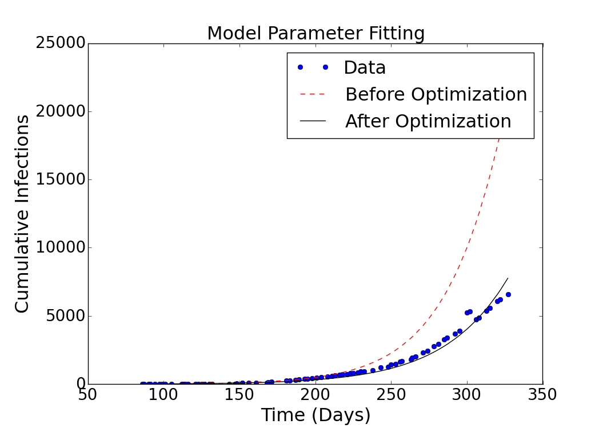
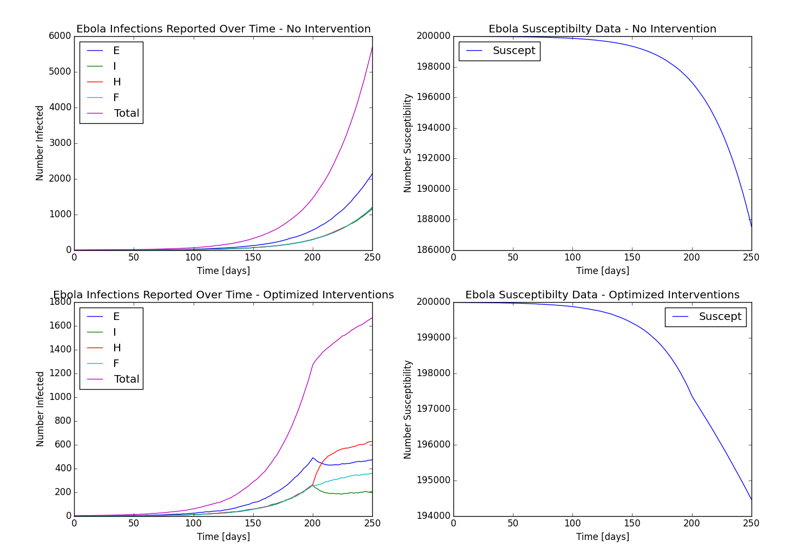

Getting Started
===============

A Simple Example
----------------

Using EbolaOpt can be easy since there are default values for all inputs.
Thus, running the following python code::

    from ebolaopt import optimize
    alloc, cost = optimize()

should give a plot of the model fit of the cases data:

After closing this plot, output that looks like the following will be printed out (output below is
edited for brevity)::

        beta_H	delta_2	theta_1	deaths
    0	33.33%	33.33%	33.33%	5092.60
    1	133.33%	33.33%	33.33%	5092.60
    2	33.33%	133.33%	33.33%	2324.20
    3	33.33%	133.33%	133.33%	1913.65
    4	-57.74%	157.74%	-0.00%	55232.25
    5	74.13%	14.20%	11.67%	3998.00
    ...
    Optimal resource allocation and cost:
        beta_H	delta_2	theta_1	deaths
        64.36%	21.64%	14.00%	4182.75

A plot of the simulation results will also be generated and saved to a file
named "out.png":

Furthermore, the data used to generate these final plots are
saved to files called "out.csv" and "out_noiv.csv", whose contents look like
(truncated for brevity)::

    t (days), S(avg), S(std dev), E(avg), E(std dev), I(avg), I(std dev), H(avg), H(std dev), F(avg), F(std dev), R(avg), R(std dev)
    0.00, 199997.00, 0.00, 0.00, 0.00, 3.00, 0.00, 0.00, 0.00, 0.00, 0.00, 0.00, 0.00
    1.25, 199996.65, 0.67, 0.35, 0.67, 2.50, 0.63, 0.35, 0.51, 0.15, 0.33, 0.00, 0.00
    2.50, 199996.05, 1.05, 0.75, 0.80, 2.15, 0.80, 0.65, 0.51, 0.35, 0.46, 0.05, 0.18
    ...

"out_noiv.csv" gives the epidemic trajectory if no interventions are applied,
while "out.csv" gives the epidemic trajectory if optimized interventions are 
applied.

Specifying More Inputs
----------------------

Suppose you would like to specify the total resource budget as well as the
costs and effects of different interventions. This can be done through a csv
file. First, create a file called "constraints.csv" containing the following::

    "total","5000"
    "time","150"
    "beta_H","60","-0.01"
    "delta_2","500","-0.05"
    "theta_1","200","0.01"

Here, the value after "total" is the total resource budget and the value after
"time" is the time at which interventions are introduced. Finally, the values 
after each intervention name correspond to their costs and effects respectively.

Suppose you also would like to specify the cases data. Create a file called
"cases.csv" containing data with the following format (truncated for brevity)::

    "Date","Guinea","Liberia","Nigeria","Sierra Leone","Spain","United States"
    "2014-03-22",49,,,,,
    "2014-03-24",86,,,,,
    "2014-03-25",86,,,,,
    "2014-03-26",86,,,,,
    "2014-03-27",103,8,,6,,

Next, run the following in python::

    from ebolaopt import optimize
    alloc, cost = optimize(constraints_file="constraints.csv", \
                           data_file="cases.csv", t_final=300, \
                           country="Liberia", out_iv_file="liberia_iv.csv", \
                           out_noiv_file="liberia_noiv.csv", \
                           figure_file="liberia.png", \
                           valid_interventions=["beta_H", "theta_1"])
                           
This tells EbolaOpt to read the constraints from "constraints.csv",
do model fitting of the data in "cases.csv" under the "Liberia" column, 
run simulations until 300 days, only consider the interventions beta_H and 
theta_1 when computing the resource allocation optimization, and output 
simulation results to files named "liberia_iv.csv", "liberia_noiv.csv", and 
"liberia.png".

Interventions
-------------

Currently EbolaOpt supports 3 interventions, listed in the following table:

=========  ===================================== ===================================================
Parameter  Intervention                          Effect
=========  ===================================== ===================================================
beta_H     PPE & other supplies                  Contact rate for hospitalized cases
delta_2    Hypothetical drug                     Fatality rate of hospitalized patients
theta_1    Contact tracing & community awareness Fraction of infected cases diagnosed & hospitalized
=========  ===================================== ===================================================

You can print this table out from inside of python with the following::

    from ebolaopt.constraints import constraints_help
    constraints_help()

