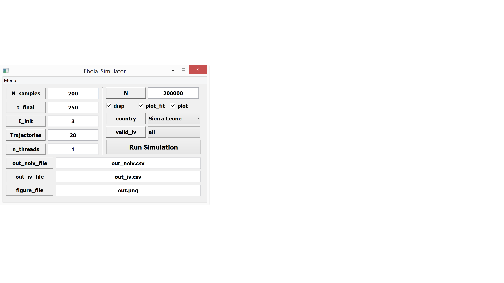

Graphical User Interface (GUI) Option
=======================================
The graphical user interface wraps the analysis into a GUI for users do not want to use the command line option. The GUI is compatible for use on both Windows and Mac OS computers with a slight variation on the look and feel of active main window. The default window options are already included and the only requirement to run the simulation is to import the applicable constraint and data files which have to be specified as .csv files. The source file to launch the GUI once all installation have been performed is the *Ebola_Simulator.py* file. Since the GUI is created in PyQt, it is important to have PyQt installed in addition to the basic python installation. PyQt installs with the latest version as the default (current default version is PyQt4).

Schematic of the User Main Window
^^^^^^^^^^^^^^^^^^^^^^^^^^^^^^^^^^^
::

	Source Code: Ebola_Simulator.py

The Windows and Mac OS versions of the GUI are shown below. Due to restrictions between platforms, the main window is fixed in geometry specification to allow ease of portability from one machine platform to the other. In order to run the simulation successfully, the data file and constraints file must be imported using the menu options defined.

safad

