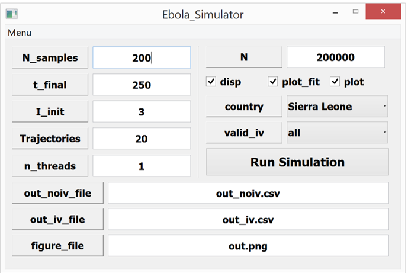

Graphical User Interface (GUI) Option
=======================================
The graphical user interface wraps the analysis into a GUI for users do not want to use the command line option. The GUI is compatible for use on both Windows and Mac OS X computers with a slight variation on the look and feel of active main window. The default window options are already included and the only requirement to run the simulation is to import the applicable constraint and data files which have to be specified as .csv files. Since the GUI is created in PyQt, it is important to have PyQt installed in addition to the basic python installation. PyQt installs with the latest version as the default (current default version is PyQt4), and can be installed through the Anaconda distribution.

How to Launch
^^^^^^^^^^^^^
In python, run::

    from ebolaopt.Ebola_Simulator import run
    run()

This will launch the GUI, in which you can easily specify your inputs and then run the optimization. Any printed outputs will be printed to where you launched the GUI from.

Schematic of the User Main Window
^^^^^^^^^^^^^^^^^^^^^^^^^^^^^^^^^
::

	Source Code: Ebola_Simulator.py

The Windows and Mac OS versions of the GUI are shown below. Due to restrictions between platforms, the main window is fixed in geometry specification to allow ease of portability from one machine platform to the other. In order to run the simulation successfully, the data file and constraints file must be imported using the menu options defined. 

Here is what the GUI looks like in Windows:

Here is what the GUI looks like in Mac OS X:

.. image:: mac_screen_shot.png

Note that on Mac OS X, selecting "run simulation" may have the additional side effect of opening a large blank grey box, but just ignore that.

Description of Inputs
^^^^^^^^^^^^^^^^^^^^^

* N_samples: number of times to sample the stochastic run to query results for generating the output
* t_final: limit of time series data, in days
* I_init: initial value for the number of infected cases in the community
* trajectories: number of times the stochastic simulation is run for consistency and stability
* n_threads: number of processors to use, OpenMP Parallelization
* N: size of the total population of susceptible persons
* disp: whether to print every step of the optimization
* plot_fit: whether to plot data fitting figure
* plot: whether to generate the final plot in a pop-out window
* country: which country's data to fit
* valid_iv: which interventions are valid to optimize over
* out_noiv_file: output filename, no interventions applied, format=.csv
* out_iv_file: output filename, interventions applied, format=.csv
* figure_file: name of the figure file to save

Note if plot_fit is True, you have to close the plot in order for the optimization to proceed.
